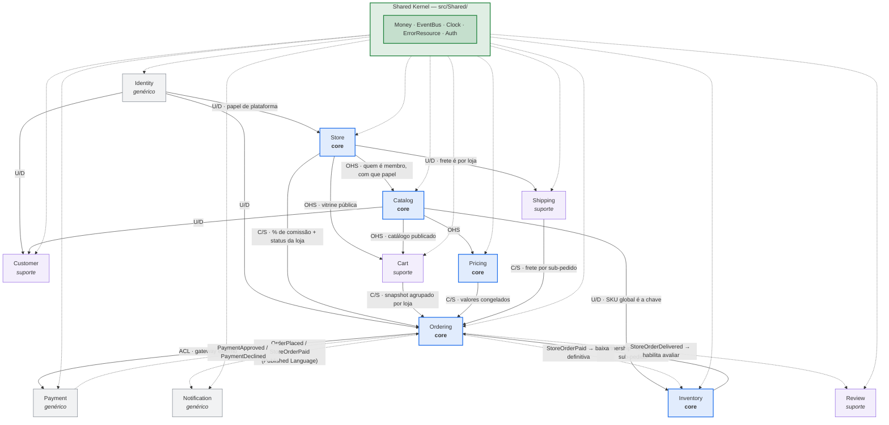

# ShopMaster — Plano de Desenvolvimento

API REST de **marketplace multi-lojista**, **Laravel + PostgreSQL**, domínio modelado em **DDD** com bounded contexts, ciclo de trabalho em **TDD**, empacotada com **Docker** e contrato publicado em **Swagger UI**.

> Este documento é o plano. Não tem cronograma: as fases são ordenadas por **dependência técnica**, não por data.

---

## 1. Escopo e princípios

### O que o ShopMaster é

Uma API REST de **marketplace multi-lojista**, no modelo Mercado Livre / Amazon Marketplace. A plataforma não vende: ela hospeda lojas de terceiros.

Três públicos consomem a **mesma** API:

- **Comprador** — navega o catálogo de todas as lojas, monta carrinho, favorita, compra e acompanha pedidos.
- **Lojista** — cria e administra suas lojas, cadastra produtos, controla estoque e despacha pedidos. Um usuário pode ter **várias** lojas, e ser membro de lojas alheias com papéis distintos.
- **Plataforma** — aprova e suspende lojas, gere categorias e cupons, e tem acesso amplo.

O mesmo usuário acumula os três primeiros papéis sem trocar de conta.

Não é um BFF. Não há canal mobile e canal web com Controllers e Resources próprios: existe **um** conjunto de recursos REST, e o que separa os públicos é **autorização**, não formato de resposta.

O detalhamento do escopo está em [requisitos.md](requisitos.md) — funcionais, não funcionais e o que ficou de fora do v1.

### Princípios inegociáveis

1. **Domínio no centro, framework na borda.** `Domain/` e `Application/` não importam Laravel, Eloquent nem HTTP. Nunca.
2. **Portas & adapters.** Use case depende de `interface`; a implementação concreta é escolhida em um único lugar (`AppServiceProvider`).
3. **Test-first.** O teste nasce vermelho antes da classe de produção. Sem exceção, nem para "feature pequena".
4. **O Swagger é contrato.** Rota que não está no `openapi.yaml` não existe.
5. **Negar por omissão.** Um campo só aparece na resposta se a feature precisar dele. `SELECT` com allowlist explícita, nunca `*`.
6. **Esta API é dona do banco.** Ao contrário da participant-api, aqui existem migrations, factories e seeders — o schema é nosso e nasce com o código.
7. **Autorização em duas camadas.** Papel de plataforma vive no token; papel de loja é resolvido por requisição. Confundir as duas é o erro estrutural mais caro deste projeto — ver §4.5.
8. **A loja é a unidade de fulfillment.** Um carrinho com itens de N lojas vira um pedido e N sub-pedidos: cada loja cota o próprio frete, despacha do seu endereço e tem o próprio estado de entrega.

---

## 2. O que se reutiliza da participant-api

O reuso é **de arquitetura**, não de código de negócio. Nada de `Event`, `Registration`, `Profile`, `PaperSubmission` ou `Certification` vem junto. O que é copiado é o *esqueleto* e as *convenções*.

### Reutilizado integralmente

| Item | Detalhe |
|---|---|
| **Separação `app/` vs `src/`** | `App\` fica só com infraestrutura de framework (Providers, Kernel HTTP). Todo o domínio vive em `src/`, um bounded context por pasta. |
| **PSR-4 raiz por contexto** | `"Catalog\\": "src/Catalog/"`, não `App\Catalog`. Declarado em `composer.json`, dump-autoload ao criar contexto novo. |
| **Camadas por contexto** | `Domain/` → `Application/` → `Infrastructure/` → `Interface/Http/`. Mesma regra de dependência: a seta só aponta para dentro. |
| **Use case = 1 classe, 1 método `handle()`** | Verbo + substantivo (`PlaceOrder`, `GetProductDetails`). Injeção via construtor. Zero HTTP, zero Eloquent. |
| **Porta = substantivo puro** | `ProductRepository`, `PaymentGateway`, `StockLedger`. Declarada em `Application/`, implementada em `Infrastructure/`. |
| **Exceção de negócio como Result implícito** | `OrderAlreadyPaid`, `OutOfStock`, `CartIsEmpty` — sempre `extends \RuntimeException`, uma classe por invariante violada. Sem Either/Result. Controller decide o status via `catch` por tipo. |
| **`final class` / `final readonly class`** | Domínio e application são finais. Sem herança de domínio. |
| **DI centralizada** | Todo bind porta → adapter em `app/Providers/AppServiceProvider.php`, agrupado por contexto e comentado com o *porquê*. |
| **`Shared/`** | Kernel compartilhado: `EventBus` + `NullEventBus`, `Http\ErrorResource`, `Auth/`, `Clock`. |
| **Formato de erro** | `{ "error": { "code", "message" } }` via `Shared\Http\ErrorResource::of()`. |
| **Auth JWT HS256 própria** | Access token + refresh token de uso único, revogação no Redis, middleware `auth.token` registrado em `bootstrap/app.php`. Mesmo desenho, adaptado a usuários que **nós** criamos. |
| **`ExampleContext/`** | Esqueleto de pastas vazias como referência do próximo contexto. |
| **Split Unit/Feature no `phpunit.xml`** | `tests/Unit/{Contexto}/` (fakes escritos à mão, sem I/O) e `tests/Feature/{Contexto}/` (banco e HTTP reais). |
| **Fake à mão, não Mockery** | Classe anônima implementando a porta, dentro do próprio teste. |
| **Teste nomeado em português** | `test_recusa_checkout_quando_o_carrinho_esta_vazio` — descreve comportamento, não implementação. |
| **`/docs` servindo Swagger UI** | Rota Blade + rota que devolve o `openapi.yaml` cru, ambas `withoutMiddleware('web')`. |
| **`docs/` como parte da entrega** | `architecture.md`, `domains.md`, `testing.md`, `auth.md`, `docker.md`, `deploy.md`, `openapi/`. |
| **`CLAUDE.md` com regras numeradas** | Doc acompanha código na mesma entrega; Swagger nunca fica para depois; nada de dado sensível não pedido; config de servidor em `deploy.md`. |
| **Skill `criar-feature`** | O ciclo Red → Green → Refactor + checklist de fechamento, adaptado ao ShopMaster. |
| **Pint + `composer test`** | Mesmo gate de qualidade. |
| **Dockerfile `php:8.x-cli` + `php -S` com `docker/router.php`** | Mesma imagem enxuta, trocando `pdo_mysql` por `pdo_pgsql`. |

### Deliberadamente **não** reutilizado

| Item da participant-api | O que fica no lugar |
|---|---|
| **MySQL / base legada `cred_doity`** | **PostgreSQL**, schema próprio, criado por migrations nossas. |
| **Proibição de migrations** | O oposto: `database/migrations/` é a fonte do schema. |
| **`DatabaseTransactions` contra base real de dev** | `RefreshDatabase` contra um banco de teste descartável. |
| **Armadilhas do schema legado** (MyISAM, latin1, ids sintéticos altos, colunas ambíguas) | Não existem. Postgres é UTF-8, transacional inclusive em DDL, e o schema é desenhado agora. |
| **Split `Interface/Http/{Mobile,Web}`** | `Interface/Http/` plano. Sub-namespace `Admin/` **só** quando o payload de back-office realmente divergir do da loja — nunca por antecipação. |
| **Firebase (progresso de aulas)** | Removido. Nenhuma dependência. |
| **S3 / object storage (avatar, arquivos)** | Removido. Imagem de produto entra como **URL externa** informada no cadastro; upload fica fora do escopo inicial. |
| **Twilio (SMS)** | Removido. Notificação é e-mail, e via fila. |
| **AWS SDK, `kreait/firebase-php`, `twilio/sdk`** | Fora do `composer.json`. |
| **Hash `sha1(SALT . senha)` da base legada** | `bcrypt`/`argon2id` nativo do Laravel — não há senha herdada para respeitar. |
| **"Esta API quase não escreve"** | Aqui a escrita é o produto: carrinho, pedido, pagamento, estoque. |

### Mantido do participant-api, mas **ampliado**

- **Redis.** Lá era cache de catálogo + blacklist de refresh token. Aqui, além disso: sessão de carrinho de visitante, lock de reserva de estoque, rate limit e **fila** (`QUEUE_CONNECTION=redis`) para e-mail transacional e webhook de pagamento.
- **`EventBus`.** Lá é `NullEventBus` puro. Aqui o barramento passa a ter listeners de verdade — é o que evita que `Ordering` importe o domínio de `Inventory` e `Notification`.

---

## 3. Stack

| Camada | Escolha | Porquê |
|---|---|---|
| Runtime | PHP 8.3+ | Mesma régua da participant-api (`readonly`, enums, tipos). |
| Framework | Laravel 12/13 | Só na borda: routing, container, validação, fila, cache. |
| Banco | **PostgreSQL 16+** | Transacional em DDL, `jsonb`, `numeric` exato, constraints de exclusão para reserva de estoque. |
| Acesso a dados | Query Builder / Eloquent **dentro de `Infrastructure/Eloquent/`** | Igual à participant-api: o adapter usa Eloquent; o domínio nunca vê. |
| Cache / fila / lock | **Redis** | Cache de catálogo (store dedicado), blacklist de refresh, carrinho de visitante, lock de estoque, fila. |
| Auth | JWT HS256 assinado na app | Sem dependência externa, stateless, mesmo desenho do participant-api. |
| Testes | PHPUnit 12 (Unit + Feature) | Mesmo `phpunit.xml` de dois testsuites. |
| Estilo | Laravel Pint | Gate de fechamento. |
| Contrato | OpenAPI 3.1 escrito à mão + **Swagger UI** em `/docs` | Validado com `@redocly/cli lint`. |
| Empacotamento | **Docker Compose** | App + Postgres + Redis, todos como containers (diferente do participant-api, que conectava nos serviços do host). |

**Dependências de produção esperadas:** `laravel/framework`, `laravel/tinker`, `predis/predis` (ou phpredis). Só isso. Sem SDK de nuvem.

---

## 4. Context Map

### 4.1 Os bounded contexts

| Contexto | Tipo | Responsabilidade | Linguagem própria |
|---|---|---|---|
| **Identity** (`Shared/Auth` + `Identity/`) | Genérico | Registro, login, refresh, papéis **de plataforma** (`buyer`, `seller`, `platform_admin`) | Credential, Session, Token, PlatformRole |
| **Store** | **Core** | A loja: criação, slug, aprovação, suspensão, **membros e papéis de loja**, percentual de comissão | Store, StoreMember, StoreRole, StoreStatus |
| **Catalog** | **Core** | Produto e variação **de uma loja**, categoria, atributos, publicação, busca | Product, Variant, Category, Sku, Gtin |
| **Pricing** | **Core** | Preço vigente, promoção, cupom da plataforma, cálculo do valor de linha | Price, Discount, Coupon, PricedLine |
| **Inventory** | **Core** | Saldo por SKU, reserva, baixa, devolução ao estoque | StockItem, Reservation, Movement |
| **Cart** | Suporte | Carrinho do visitante e do cliente, **itens de várias lojas**, recálculo | Cart, CartItem |
| **Ordering** | **Core** | Pedido, **sub-pedido por loja**, checkout, máquina de estados, comissão congelada | Order, StoreOrder, OrderLine, OrderStatus |
| **Payment** | Genérico | Intenção de pagamento **única para o pedido**, confirmação, estorno, webhook | PaymentIntent, Charge, Refund |
| **Shipping** | Suporte | Endereço, cotação de frete **por loja**, rastreio | Shipment, ShippingQuote, Address |
| **Customer** | Suporte | Dados do cliente, endereços salvos, **favoritos** | Customer, AddressBook, Favorite |
| **Notification** | Genérico | E-mail transacional, disparado por evento de domínio | Notification, Template |
| **Review** | Suporte (fase tardia) | Avaliação de produto por quem recebeu | Review, Rating |

`Shared/` guarda o que é cross-cutting e **não é domínio de negócio**: `EventBus`, `Http\ErrorResource`, `Clock`, `Money`, `Auth`.

### 4.2 O mapa



Linha cheia = dependência síncrona (o consumidor chama o use case do fornecedor). Linha tracejada = comunicação **assíncrona por evento de domínio**, via `EventBus`.

### 4.3 As relações, uma a uma

| De → Para | Padrão | Como se materializa no código |
|---|---|---|
| **Store → Catalog** | *Open Host Service* | Todo produto pertence a uma loja. `Catalog` pergunta ao `Store` se quem está cadastrando é membro com papel suficiente, e se a loja está `active`. Não lê a tabela de membros — chama o use case. |
| **Store → Ordering** | *Customer/Supplier* | No checkout, `Ordering` pede ao `Store` o percentual de comissão vigente e o status da loja, e **congela** o percentual na linha. Loja suspensa reprova o checkout daquele grupo. |
| **Store → Shipping** | *Upstream/Downstream* | A tabela de frete é da loja: cada uma cota a partir do próprio endereço de origem. |
| **Cart → Ordering** | *Customer/Supplier* | O checkout lê o carrinho, **agrupa por loja** e congela um snapshot por linha: título, SKU, preço unitário, desconto e comissão viram colunas de `order_lines`. O pedido nunca mais consulta o Cart. |
| **Catalog → Cart / Pricing / Customer** | *Open Host Service* | `Catalog` expõe use cases de leitura (`GetPublishedProduct`, `GetVariantsByIds`) com VOs próprios. Favoritos, carrinho e preço consomem esse contrato — não o Eloquent nem a tabela. |
| **Catalog → Inventory** | *Upstream/Downstream* | O **SKU global** é a chave compartilhada. `Inventory` não sabe nome, preço nem de que loja é — só o SKU e o saldo. É por isso que o SKU precisa ser único na plataforma inteira. |
| **Pricing → Ordering** | *Customer/Supplier* | `Ordering` pede a `Pricing` o total (`QuoteCart`), recebe valores calculados e os congela. Regra de cupom nunca é reimplementada no Ordering. |
| **Inventory ↔ Ordering** | **Partnership** | A única relação bidirecional. O checkout **reserva** (`ReserveStock`, com TTL no Redis); o pagamento aprovado **baixa** (`CommitReservation`); o cancelamento ou a expiração **devolve** (`ReleaseReservation`). Evoluem juntos porque a invariante "não vender o que não tem" é dos dois. |
| **Ordering → Payment** | **Anticorruption Layer** | O gateway é externo e fala a língua dele. A porta é `PaymentGateway` com VOs do ShopMaster; o adapter traduz. Trocar de gateway = novo adapter, zero mudança no domínio. |
| **Shipping → Ordering** | *Customer/Supplier* | `Shipping` cota **por loja**; `Ordering` congela valor e prazo em cada sub-pedido. |
| **Identity → todos** | *Upstream/Downstream* | O middleware `auth.token` resolve o token e injeta o usuário e seus papéis de plataforma. Nenhum contexto reimplementa autenticação. |
| **Ordering → Notification / Review** | **Published Language** | Só eventos de domínio: `OrderPlaced`, `StoreOrderPaid`, `StoreOrderShipped`, `StoreOrderDelivered`, `StoreOrderCancelled`. São DTOs `readonly` em `Domain/`. `Notification` reage; `Ordering` não sabe que ele existe. |
| **Todos → `Shared/`** | **Shared Kernel** | Minúsculo de propósito: `Money`, `EventBus`, `Clock`, `ErrorResource`, `Auth`. Só entra aqui o que **três ou mais** contextos usam e que não é regra de negócio de nenhum. |

### 4.4 As duas camadas de autorização

É a decisão que mais molda o desenho, e a que mais se erra em marketplace.

| Camada | Onde vive | Valores | Por quê |
|---|---|---|---|
| **Papel de plataforma** | No **token** | `buyer`, `seller`, `platform_admin` (acumuláveis) | Conjunto pequeno e limitado. Cabe no JWT sem inchar. |
| **Papel de loja** | **Fora do token**, resolvido por requisição pelo `Store` | `owner`, `admin`, `finance` — um por loja | O número de lojas por usuário é ilimitado; um token que carregasse todas cresceria sem teto e ficaria obsoleto no instante em que alguém fosse removido de uma loja. |

Na prática: o middleware `auth.token` autentica e injeta os papéis de plataforma; o middleware `store.role:admin` lê o `{storeId}` da rota, pergunta ao `Store` qual o papel daquele usuário naquela loja, e reprova quem não tem. A resposta é cacheada no Redis com TTL curto (`shopmaster.store.role_cache_ttl`) — esse TTL é, literalmente, o atraso máximo entre remover um membro e ele perder o acesso.

Loja da qual o usuário não é membro devolve **404**, não 403: um 403 confirmaria que a loja existe.

### 4.5 A regra de fronteira, escrita como lei

> Um contexto **nunca** importa `Domain/` ou `Infrastructure/` de outro contexto.

Existem exatamente três formas legítimas de atravessar a fronteira:

1. **Chamar o use case do outro contexto** (`Application/`), recebendo o VO dele.
2. **Compor na camada de interface** — o Controller chama dois use cases e junta no Resource. É o padrão do `MyEventsController`/`TicketController` da participant-api.
3. **Reagir a um evento de domínio** publicado no `EventBus`.

Qualquer `use Catalog\Infrastructure\...` dentro de `src/Ordering/` é bug de arquitetura, e o teste de arquitetura da Fase 0 quebra por causa dele.

---

## 5. Estrutura de pastas

```
shopmaster/
├── app/                              # Laravel puro
│   ├── Http/Controllers/Controller.php
│   └── Providers/AppServiceProvider.php   # TODO bind porta → adapter, agrupado por contexto
│
├── bootstrap/app.php                 # alias 'auth.token', JSON em erro sob /v1/*
│
├── config/
│   ├── database.php                  # conexão pgsql + conexões Redis (default, catalog, cart, queue)
│   ├── cache.php                     # store dedicado 'catalog' (Redis DB próprio)
│   ├── jwt.php                       # secret, issuer, ttl, refresh_ttl
│   └── shopmaster.php                # TTLs, moeda, janela de reserva, política de cancelamento
│
├── database/
│   ├── migrations/                   # A FONTE DO SCHEMA — aqui, sim
│   ├── factories/                    # por contexto
│   └── seeders/                      # catálogo de demonstração + admin
│
├── docker/
│   ├── router.php                    # mesmo router do participant-api
│   └── postgres/init.sql             # extensões (citext, pgcrypto)
├── Dockerfile
├── compose.yaml                      # app + postgres + redis
│
├── docs/
│   ├── project.md                    # por que esta arquitetura existe
│   ├── domains.md                    # o context map desta seção, mantido vivo
│   ├── architecture/
│   │   ├── architecture.md           # camadas, regra de dependência, nomes
│   │   └── data-flow.md              # o caminho de uma compra, ponta a ponta
│   ├── auth.md
│   ├── testing.md
│   ├── docker.md
│   ├── deploy.md
│   └── openapi/openapi.yaml          # contrato, à mão
│
├── routes/
│   ├── api.php                       # /v1 público + /v1/admin
│   └── web.php                       # /docs (Swagger UI) + /docs/openapi.yaml
│
├── src/
│   ├── Shared/
│   │   ├── Auth/{Domain,Application,Infrastructure,Interface}
│   │   ├── Http/ErrorResource.php
│   │   ├── Money.php
│   │   ├── Clock.php
│   │   ├── EventBus.php
│   │   └── NullEventBus.php
│   ├── Identity/
│   ├── Customer/
│   ├── Store/                    # loja, membros, papéis de loja, comissão
│   ├── Catalog/
│   ├── Pricing/
│   ├── Inventory/
│   ├── Cart/
│   ├── Ordering/
│   ├── Payment/
│   ├── Shipping/
│   ├── Notification/
│   ├── Review/
│   └── ExampleContext/               # esqueleto vazio de referência
│
└── tests/
    ├── Architecture/                 # a regra de dependência, testada
    ├── Unit/{Contexto}/              # use cases com fake das portas — sem I/O
    └── Feature/{Contexto}/           # rotas HTTP e repositórios contra Postgres real
```

Por contexto, sempre:

```
src/<Context>/
├── Domain/            # VOs imutáveis, enums de estado, eventos de domínio, regras puras
├── Application/       # 1 classe por use case + portas (interfaces) + exceções de negócio
├── Infrastructure/
│   ├── Eloquent/      # repositórios concretos, com allowlist de colunas
│   ├── Cache/         # adapters Redis
│   └── Http/          # clients de serviço externo (só em Payment/Shipping)
└── Interface/Http/
    ├── Controllers/
    ├── Resources/
    ├── Requests/
    └── Admin/         # SÓ se o payload de back-office divergir de verdade
```

---

## 6. Superfície REST

Prefixo `/v1`. Erro sempre em `{ "error": { "code", "message" } }`.

A superfície tem três famílias, e a fronteira entre elas é de **autorização**, não de formato:

- **pública / comprador** — `/v1/...`
- **lojista** — `/v1/stores/{storeId}/...`, protegida por `store.role`
- **plataforma** — `/v1/admin/...`, protegida por `role:platform_admin`

### Comprador

| Rota | Auth | Contexto |
|---|---|---|
| `POST /v1/auth/register` · `POST /v1/auth` · `POST /v1/auth/refresh` | pública | Identity |
| `GET /v1/products` | pública | Catalog (filtro por categoria, preço e **loja**) |
| `GET /v1/products/{slug}` | pública | Catalog + Pricing + Inventory + Store + Review |
| `GET /v1/categories` | pública | Catalog |
| `GET /v1/stores/{slug}` | pública | Store (vitrine) + Catalog |
| `POST /v1/carts` · `GET/POST/PATCH/DELETE /v1/carts/{id}[/items[/{itemId}]]` | pública/Bearer | Cart |
| `POST /v1/carts/{id}/coupon` | pública/Bearer | Pricing |
| `POST /v1/shipping/quotes` | pública/Bearer | Shipping (uma cotação **por loja** do carrinho) |
| `POST /v1/checkout` | Bearer | Ordering |
| `GET /v1/orders` · `GET /v1/orders/{id}` | Bearer | Ordering |
| `POST /v1/orders/{id}/cancel` | Bearer | Ordering |
| `POST /v1/orders/{id}/payment` | Bearer | Payment |
| `GET /v1/me` · `PATCH /v1/me` | Bearer | Customer |
| `GET/POST/PATCH/DELETE /v1/me/addresses[/{id}]` | Bearer | Customer |
| `GET /v1/me/favorites` · `PUT/DELETE /v1/me/favorites/{productId}` | Bearer | Customer |
| `GET /v1/me/stores` | Bearer | Store (as lojas em que sou membro, e com que papel) |
| `POST /v1/products/{id}/reviews` | Bearer | Review |

### Lojista

Todas sob `auth.token` + `store.role`. O papel exigido está na coluna.

| Rota | Papel mínimo | Contexto |
|---|---|---|
| `POST /v1/stores` | — (basta `buyer`) | Store — cria a loja e promove o autor a `seller` |
| `GET /v1/stores/{storeId}` · `PATCH` | `admin` | Store |
| `GET /v1/stores/{storeId}/members` | `admin` | Store |
| `POST/PATCH/DELETE /v1/stores/{storeId}/members[/{userId}]` | `owner` | Store |
| `POST /v1/stores/{storeId}/transfer-ownership` | `owner` | Store |
| `GET/POST/PATCH/DELETE /v1/stores/{storeId}/products[/{id}]` | `admin` | Catalog |
| `POST/PATCH /v1/stores/{storeId}/products/{id}/variants[/{variantId}]` | `admin` | Catalog |
| `POST /v1/stores/{storeId}/products/{id}/publish` | `admin` | Catalog |
| `PATCH /v1/stores/{storeId}/inventory/{sku}` | `admin` | Inventory |
| `GET /v1/stores/{storeId}/orders` · `GET /v1/stores/{storeId}/orders/{id}` | `admin` | Ordering (sub-pedidos da loja) |
| `POST /v1/stores/{storeId}/orders/{id}/ship` | `admin` | Ordering |
| `GET/PUT /v1/stores/{storeId}/shipping-rates` | `admin` | Shipping |
| `GET /v1/stores/{storeId}/statement` | `finance` | Ordering (extrato: bruto, comissão, líquido) |

### Plataforma

| Rota | Auth | Contexto |
|---|---|---|
| `GET /v1/admin/stores` · `POST /v1/admin/stores/{id}/approve` · `/suspend` | `platform_admin` | Store |
| `POST/PATCH/DELETE /v1/admin/categories[/{id}]` | `platform_admin` | Catalog |
| `POST/PATCH/DELETE /v1/admin/coupons[/{id}]` | `platform_admin` | Pricing |
| `GET /v1/admin/orders` | `platform_admin` | Ordering |
| `POST /v1/admin/orders/{id}/refund` | `platform_admin` | Payment |
| `PATCH /v1/admin/users/{id}/roles` | `platform_admin` | Identity |
| `DELETE /v1/admin/reviews/{id}` | `platform_admin` | Review |

### Integração

- `POST /v1/webhooks/payments/{provider}` — assinatura HMAC, sem token.
- **Swagger UI** em `GET /docs`, servindo `GET /docs/openapi.yaml` — sem middleware `web`.
- **Health** em `GET /up`.

---

## 7. Fases de desenvolvimento

Ordenadas por dependência. Cada fase só começa com a anterior verde, Swagger atualizado e `docs/` fechado.

### Fase 0 — Fundação

Sem esta fase, todo o resto nasce torto.

- Laravel novo; limpar o que não se usa.
- `composer.json`: PSR-4 raiz por contexto + `Shared\`. Sem AWS, sem Firebase, sem Twilio.
- `config/database.php` com conexão `pgsql`; `config/cache.php` com store `catalog` em Redis DB dedicado.
- `bootstrap/app.php`: alias `auth.token`, `shouldRenderJsonWhen` para `v1/*`.
- `Shared/`: `EventBus` + `NullEventBus`, `Http\ErrorResource`, `Clock` + `SystemClock`, VO `Money`.
- `ExampleContext/` com as pastas vazias e `.gitkeep`.
- `phpunit.xml` com os testsuites `Unit`, `Feature` e `Architecture`; banco de teste próprio.
- **Docker**: `Dockerfile` (`php:8.4-cli` + `pdo_pgsql`, `zip`, `intl`, Composer) e `compose.yaml` com `app`, `postgres` e `redis` — aqui os serviços **são** containers, com volume nomeado para o dado do Postgres e healthcheck antes do app subir.
- `/docs` com Swagger UI + `openapi.yaml` mínimo (info, servers, o `Error` schema, o security scheme Bearer).
- `CLAUDE.md` com as regras do projeto e a skill `criar-feature` adaptada.
- `docs/` inicial: `project.md`, `architecture/architecture.md`, `domains.md` (este context map), `testing.md`, `docker.md`, `deploy.md`.

**Teste de arquitetura** (o que a participant-api não tinha, e que aqui vale a pena ter desde o início):

- nenhuma classe em `src/*/Domain/` ou `src/*/Application/` importa `Illuminate\*`;
- nenhum contexto importa `Domain/` ou `Infrastructure/` de outro contexto;
- toda classe em `Domain/` e `Application/` é `final`.

**Pronto quando:** `docker compose up` sobe os três containers, `/up` responde 200, `/docs` renderiza, `composer test` verde, Pint limpo.

### Fase 1 — Identity + Customer

- **Domain:** `Credential`, `Session`, `TokenPair`, `TokenClaims`, enum `PlatformRole` (`buyer`, `seller`, `platform_admin` — **acumuláveis**), `Customer`, `Address`.
- **Application:** `RegisterCustomer`, `Authenticate`, `RefreshAccessToken`, `AuthenticateAccessToken`, `GrantPlatformRole`, `GetMyProfile`, `UpdateMyProfile`, `AddAddress`, `RemoveAddress`. Exceções: `InvalidCredentials`, `EmailAlreadyRegistered`, `ExpiredToken`, `RefreshTokenAlreadyUsed`.
- **Portas:** `CredentialRepository`, `PasswordHasher`, `TokenIssuer`, `RefreshTokenBlacklist`, `CustomerRepository`, `Clock`.
- **Infrastructure:** `HmacJwtTokenIssuer` (puro, testável em Unit), `BcryptPasswordHasher`, `RedisRefreshTokenBlacklist`, repositórios Eloquent.
- **Interface:** middleware `auth.token` + middleware `role:platform_admin`.

**Migrations:** `users`, `user_platform_roles`, `customers`, `addresses`. E-mail em `citext` — unicidade sem diferenciar maiúsculas, sem `LOWER()` espalhado por toda query.

**Favoritos ficam para a Fase 3**, quando houver produto para favoritar.

**Aqui se corrige um débito herdado:** na participant-api os três use cases de Auth só têm cobertura indireta via Feature test. No ShopMaster eles **nascem** com Unit test e fakes das portas. Está escrito no `docs/testing.md` de lá como débito conhecido; não se repete.

**Migrations:** `users`, `customers`, `addresses`.

### Fase 2 — Store

O contexto que faz disto um marketplace. Vem antes do Catalog porque **todo produto pertence a uma loja**, e a autorização de segunda camada nasce aqui.

- **Domain:** `Store`, `StoreMember`, enum `StoreRole` (`owner`, `admin`, `finance`), enum `StoreStatus` (`pending_approval`, `active`, `suspended`), `StoreSlug`, `CommissionRate`.
- **Application:** `CreateStore`, `UpdateStore`, `ApproveStore`, `SuspendStore`, `InviteMember`, `ChangeMemberRole`, `RemoveMember`, `TransferOwnership`, `GetStorefront`, `ListMyStores`, `ResolveStoreRole` (o use case que o middleware consome). Exceções: `StoreNotFound`, `SlugAlreadyTaken`, `StoreLimitReached`, `NotAStoreMember`, `InsufficientStoreRole`, `CannotDemoteOwner`, `StoreNotActive`.
- **Portas:** `StoreRepository`, `StoreMemberRepository`, `StoreRoleCache`.
- **Infrastructure:** repositórios Eloquent; `RedisStoreRoleCache` com TTL curto — esse TTL **é** o atraso máximo entre remover um membro e ele perder o acesso.
- **Interface:** middleware `store.role:{papel}`, que lê o `{storeId}` da rota. Loja da qual o usuário não é membro devolve **404**, não 403.

**Migrations:** `stores`, `store_members`.

Invariantes que ganham teste nesta fase: a loja tem exatamente um `owner`; o `owner` não se rebaixa nem se remove; criar a primeira loja concede o papel `seller`; loja `pending_approval` não aparece no catálogo.

### Fase 3 — Catalog

- **Domain:** `Product` (pertence a uma loja), `Variant`, `Sku` (VO com formato validado), `Gtin` (opcional), `Category`, `ProductStatus` (draft/published/archived), `Slug`.
- **Application:** `CreateProduct`, `UpdateProduct`, `PublishProduct`, `ArchiveProduct`, `BrowseProducts` (filtro por categoria, faixa de preço e **loja**; paginação por cursor), `GetPublishedProduct`, `GetVariantsByIds` (o OHS que Cart e Ordering consomem), `ListStoreProducts`, `ListCategories`. Exceções: `ProductNotFound`, `SkuAlreadyExists`, `CannotPublishWithoutVariant`, `StoreNotActive`.
- **Portas:** `ProductRepository`, `CategoryRepository`, `CatalogCache`, e o use case `ResolveStoreRole` do `Store` (chamado, não importado por dentro).
- **Infrastructure:** `EloquentProductRepository` com allowlist explícita; `RedisCatalogCache` no store dedicado, invalidado na publicação; índice GIN `pg_trgm` na busca textual.
- **Interface:** rotas públicas de leitura + `/v1/stores/{storeId}/products` para escrita, sob `store.role:admin`.

**Também nesta fase:** favoritos (`Customer`) — `AddFavorite`, `RemoveFavorite`, `ListFavorites`. Só agora existe produto para favoritar.

**Migrations:** `categories`, `products`, `product_variants`, `product_images`, `product_category` (pivot), `favorites`. Atributos variáveis em `jsonb`.

**O SKU é único na plataforma inteira** — `UNIQUE` simples em `product_variants.sku`, não composto com `store_id`. É o que permite ao `Inventory` indexar por SKU sem saber de loja. Ver §7.1 de [requisitos.md](requisitos.md).

**Decisões registradas:**
- Produto não publicado **não existe** para a rota pública — mesmo 404 de produto inexistente, sem revelar que há um rascunho.
- Produto de loja `pending_approval` ou `suspended` também não aparece. Loja suspensa não vende (RN-01).
- O `gtin` é gravado mas hoje só informativo: é a ponte para um eventual catálogo mestre, sem custo nenhum agora.

### Fase 4 — Inventory

- **Domain:** `StockItem`, `Reservation`, `Movement`, `MovementReason` (entrada, venda, cancelamento, ajuste, devolução).
- **Application:** `AdjustStock`, `ReserveStock`, `CommitReservation`, `ReleaseReservation`, `GetAvailability`. Exceções: `OutOfStock`, `ReservationExpired`, `ReservationNotFound`.
- **Portas:** `StockRepository`, `ReservationStore`, `Clock`.
- **Infrastructure:** repositório Eloquent com `SELECT ... FOR UPDATE` na baixa; `RedisReservationStore` com TTL — a reserva expira sozinha se o checkout for abandonado.
- **Livro-razão, não contador.** Saldo é derivado de movimentos; `stock_movements` é append-only e auditável.

**Migrations:** `stock_items`, `stock_movements`, `stock_reservations`.

**Concorrência é o teste principal desta fase.** Feature test que dispara duas reservas concorrentes do último item e prova que exatamente uma vence.

### Fase 5 — Pricing

- **Domain:** `Price`, `Discount`, `Coupon`, `DiscountType` (percentual, fixo, frete grátis), `PricedLine`, `CartQuote`.
- **Application:** `SetProductPrice`, `CreateCoupon`, `ValidateCoupon`, `QuoteCart` (o cálculo do total: linhas → descontos → cupom → total). Exceções: `CouponExpired`, `CouponNotApplicable`, `CouponUsageLimitReached`, `MinimumOrderNotMet`.
- **Portas:** `PriceRepository`, `CouponRepository`.
- **Regra de ouro:** o cálculo de total mora **aqui e só aqui**. Nem Cart nem Ordering somam preço por conta própria — os dois chamam `QuoteCart`.

**Migrations:** `prices`, `coupons`, `coupon_redemptions`.

**Dinheiro:** coluna `numeric(12,2)`, nunca `float` e nunca o tipo `money` do Postgres. O VO `Shared\Money` guarda inteiro em centavos e converte por string na fronteira — é o único ponto de conversão da aplicação. A moeda viaja junto do valor.

### Fase 6 — Cart

- **Domain:** `Cart`, `CartItem`, `CartId` (UUIDv7 opaco).
- **Application:** `CreateCart`, `AddItemToCart`, `ChangeItemQuantity`, `RemoveItemFromCart`, `GetCart` (compõe com `QuoteCart` e `GetAvailability`), `MergeGuestCart` (o carrinho do visitante que faz login funde no do cliente). Exceções: `CartNotFound`, `CartItemNotFound`, `VariantNotPurchasable`.
- **Portas:** `CartRepository`.
- **Infrastructure:** carrinho de **visitante** vive no Redis com TTL; carrinho de **cliente logado** é persistido no Postgres. Duas implementações da mesma porta, escolhidas por presença de token — decisão registrada em `docs/architecture/data-flow.md`.

**Migrations:** `carts`, `cart_items`.

### Fase 7 — Shipping

- **Domain:** `ShippingAddress`, `ShippingQuote`, `ShippingMethod`, `Weight`, `PostalCode`.
- **Application:** `QuoteShipping`, `ListShippingMethods`. Exceções: `AddressNotDeliverable`, `NoShippingMethodAvailable`.
- **Portas:** `ShippingRatesProvider` — **ACL** para transportadora.
- **Infrastructure:** `TableShippingRates` (tabela de faixa por CEP/peso, configurada no banco) como implementação inicial. Integração com transportadora real fica como um segundo adapter, sem tocar no domínio.

**Migrations:** `shipping_methods`, `shipping_rates`.

### Fase 8 — Ordering

O coração. Só faz sentido com 1–7 verdes.

- **Domain:** `Order` (o pedido do cliente), **`StoreOrder`** (o sub-pedido de uma loja), `OrderLine` (pertence a um `StoreOrder`), `StoreOrderStatus` (enum: `pending_payment` → `paid` → `shipped` → `delivered`; `cancelled` a partir dos dois primeiros), `OrderNumber`, e a **máquina de estados** com transições válidas explícitas. Eventos: `OrderPlaced`, `StoreOrderPaid`, `StoreOrderShipped`, `StoreOrderDelivered`, `StoreOrderCancelled`.
- **Application:** `PlaceOrder` (o checkout), `GetMyOrders`, `GetOrderDetails`, `CancelOrder`, `ListStoreOrders`, `ShipStoreOrder`, `MarkStoreOrderAsDelivered`, `GetStoreStatement`. Exceções: `OrderNotFound`, `CartIsEmpty`, `InvalidStatusTransition`, `OrderAlreadyPaid`, `OrderCannotBeCancelled`, `CannotBuyFromOwnStore`.
- **Portas:** `OrderRepository`, `OrderNumberGenerator`, `EventBus`, e as portas *dos outros contextos* que o checkout orquestra.

**O estado do pedido é derivado** dos sub-pedidos, nunca mantido em paralelo: dois campos de estado que precisam concordar acabam discordando.

**O checkout, passo a passo** — o caso que justifica o desenho todo:

1. Lê o carrinho (`GetCart`) e **agrupa os itens por loja**.
2. Para cada loja: confirma que está `active` e obtém o percentual de comissão vigente (`Store`).
3. Pede o total à `Pricing` (`QuoteCart`).
4. Reserva estoque de cada linha (`ReserveStock`).
5. Cota e congela o frete **de cada loja** (`QuoteShipping`).
6. Cria o pedido em `pending_payment` com **um `StoreOrder` por loja**, e snapshot em cada linha: título, SKU, preço unitário, desconto e **comissão**.
7. Publica `OrderPlaced`.
8. Se qualquer passo falhar, **libera as reservas já feitas** e propaga a exceção de negócio.

Regra que ganha teste aqui: **ninguém compra de si mesmo** (RN-02) — membro de uma loja não finaliza compra contendo produto dela.

Passos 4–6 rodam em uma transação do Postgres. O passo 7 sai **depois** do commit — evento disparado dentro de transação que faz rollback é e-mail mentiroso na caixa do cliente.

**Idempotência:** `POST /v1/checkout` aceita header `Idempotency-Key`, guardado no Redis. Duplo clique não vira dois pedidos.

**Migrations:** `orders`, `store_orders`, `order_lines`, `store_order_status_history`. Valores monetários em `numeric(12,2)`; a comissão congelada é coluna de `order_lines`.

### Fase 9 — Payment

- **Domain:** `PaymentIntent`, `Charge`, `Refund`, `PaymentMethod`, `PaymentStatus`. Eventos: `PaymentApproved`, `PaymentDeclined`, `PaymentRefunded`.
- **Application:** `StartPayment`, `ConfirmPayment`, `HandleProviderWebhook`, `RefundPayment`. Exceções: `PaymentAlreadyConfirmed`, `PaymentDeclined`, `RefundNotAllowed`.
- **Portas:** `PaymentGateway` — o **ACL**. Métodos em linguagem ShopMaster: `authorize(Money, PaymentMethod): Charge`.
- **Infrastructure:** `FakePaymentGateway` primeiro (aprova, recusa e expira conforme regra determinística) — é o que permite fechar o ciclo de compra sem depender de terceiro. Gateway real entra depois como segundo adapter.
- **Webhook:** assinatura HMAC verificada antes de qualquer processamento; entrega repetida é idempotente por `provider_event_id`.

**Pagamento é único para o pedido inteiro** (RN-06), mesmo com várias lojas: o cliente paga uma vez, e o rateio é interno. Split payment real no gateway está fora do v1.

**Reação de `PaymentApproved`:** listener move **todos os sub-pedidos** para `paid`, chama `CommitReservation` no Inventory e publica um `StoreOrderPaid` por loja. Tudo por evento — `Payment` não conhece `Ordering`.

**Migrations:** `payments`, `payment_events`.

### Fase 10 — Notification

- **Domain:** `Notification`, `NotificationChannel`.
- **Application:** `SendOrderConfirmation`, `SendPaymentReceipt`, `SendShipmentUpdate` — todos disparados por **listener de evento de domínio**, nunca chamados direto por outro contexto.
- **Infrastructure:** Mailable do Laravel + fila Redis. E-mail nunca bloqueia a resposta HTTP.
- **Degradação:** SMTP fora do ar não derruba compra. Falha vai para o log e para a fila de retry, e isso fica escrito em `docs/deploy.md` (RULE 4: degradação silenciosa é obrigatória de documentar).

### Fase 11 — Review

- **Domain:** `Review`, `Rating` (VO 1–5 validado).
- **Application:** `SubmitReview`, `ListProductReviews`, `GetProductRatingSummary`, `DeleteReview` (só `platform_admin`). Exceção: `ReviewNotAllowed` — só quem tem **sub-pedido** `delivered` contendo aquele produto avalia, e uma vez só.
- Média agregada em cache Redis, invalidada a cada nova avaliação.

**Migrations:** `reviews`.

### Fase 12 — Endurecimento

- Rate limit por IP nas rotas públicas e por usuário nas autenticadas (Redis).
- Paginação por cursor no catálogo e nos pedidos.
- Índices revisados com `EXPLAIN ANALYZE` nas consultas quentes (busca de produto, pedidos do cliente, saldo por SKU).
- Log estruturado com correlation id por requisição.
- Seeder de demonstração: duas lojas com donos distintos, catálogo, cupons, um `platform_admin` e um comprador — o suficiente para exercitar um checkout multi-loja de ponta a ponta.
- `docs/deploy.md` completo: toda variável de ambiente, o que quebra sem ela, e o que só degrada.

---

## 8. O ciclo de TDD

Idêntico ao da skill `criar-feature` da participant-api, com uma adaptação: o schema é nosso, então a migration entra no passo de Infrastructure em vez de "investigar o banco legado".

### Ordem, por feature

**1. Fronteira.** A qual contexto isso pertence? Precisa de dado de outro contexto? Se sim, **compõe na interface** ou **reage a evento** — não importa o domínio alheio.

**2. RED — o teste antes da classe.**
Declara a porta (só a `interface`) e escreve o Unit test do use case com um fake escrito à mão:

```php
private function stockWith(array $balances): StockRepository
{
    return new class($balances) implements StockRepository
    {
        public function __construct(private array $balances) {}

        public function availableFor(Sku $sku): int
        {
            return $this->balances[$sku->value()] ?? 0;
        }
    };
}
```

Cobre o caminho feliz, **cada exceção de negócio** e as bordas (quantidade zero, produto arquivado, cupom vencido, pedido de outro cliente). Roda e confirma que falha **pela razão certa** — "classe não existe", não erro de sintaxe.

Se a porta ganhou método novo, os fakes existentes quebram: adiciona o método neles lançando `LogicException('not needed by this test')`.

**3. GREEN — o mínimo.** Implementa `Domain/` e `Application/`. Regra de negócio mora aqui, nunca no Controller nem no Resource. Um predicado de domínio (`Order::canBeCancelled()`) é o lugar certo de uma regra como "pedido enviado não cancela".

**4. Infrastructure.** Só com 2–3 verdes. Migration + adapter Eloquent com allowlist explícita de colunas. Bind em `AppServiceProvider`. Feature test do repositório contra o Postgres real.

**5. Interface/Http.** Controller + Resource + Request + rota. O Controller traduz HTTP ↔ domínio e mapeia exceção → status. Feature test batendo na rota real, incluindo o caso sem token e o caso com token de outro usuário.

**6. Verificação fora da suíte.** Feature test roda com variáveis próprias e **pode mascarar bug de ambiente** — aconteceu na participant-api: endpoint quebrado em produção passava nos dois níveis de teste. Bate no endpoint de verdade:

```bash
curl -s -H "Authorization: Bearer $TOKEN" http://127.0.0.1:8000/v1/orders | python3 -m json.tool
```

### A régua: Unit ou Feature

Não é "está em `Domain/`" — é **tem I/O real ou não**:

| Camada | I/O? | Teste | O que prova |
|---|---|---|---|
| `Domain/` | Nunca | **Unit** | Invariantes, construção de VO, transições de estado |
| `Application/` | Não — só via portas | **Unit**, com fake | Orquestração: qual porta é chamada, em que ordem, qual exceção sai de qual cenário |
| `Infrastructure/` puro (JWT, cálculo) | Não | **Unit** direto | O algoritmo |
| `Infrastructure/` com I/O | Sim | **Feature** | Que a query traduz a linha certo |
| `Interface/Http/` | Sim | **Feature** | Rota, validação, status, formato do JSON |
| Fronteira entre contextos | — | **Architecture** | Que ninguém atravessou por dentro |

### Banco nos testes

`RefreshDatabase` contra um Postgres de teste (banco separado no mesmo container). Sem as armadilhas do legado: sem MyISAM, sem latin1, sem id sintético alto. Postgres faz DDL transacional, então a suíte fica rápida e limpa.

Fixture nasce de **factory**, nunca de `INSERT` cru, e nunca com id hardcoded.

---

## 9. Docker

Diferença relevante em relação à participant-api: **lá** o MySQL e o Redis eram do host e o container só se conectava neles (`host.docker.internal`). Aqui, o compose sobe tudo.

```yaml
services:
  app:        # php:8.4-cli, php -S com docker/router.php, porta 8000
  postgres:   # postgres:16-alpine, volume nomeado, healthcheck pg_isready
  redis:      # redis:7-alpine, appendonly
```

- `app` depende de `postgres` e `redis` com `condition: service_healthy` — sem isso a primeira migration corre antes do banco aceitar conexão.
- Volume nomeado para o dado do Postgres; volume anônimo em `/app/vendor` para o bind mount do código não apagar as dependências instaladas na imagem.
- **macOS:** `colima start` antes de qualquer coisa — o Docker Engine é nativo do Linux e no macOS roda dentro de uma VM. Em Linux e WSL2 esse passo não existe.
- Um `worker` (mesmo image, `php artisan queue:work`) entra na Fase 9, junto da Notification.
- Setup em um comando: `docker compose up -d --build && docker compose exec app php artisan migrate --seed`.

Tudo isso vive em `docs/docker.md`; o que o **servidor** precisa vive em `docs/deploy.md`.

---

## 10. Swagger

`docs/openapi/openapi.yaml` é a **fonte única** do contrato, escrita à mão — não gerada por anotação no código. Servida em `/docs` pela mesma dupla de rotas da participant-api.

Regra de fechamento, aplicada **assim que a suíte fica verde** e antes de dar a tarefa por encerrada:

1. Atualizar path, schemas, exemplos e **todos** os códigos de erro que a rota pode devolver.
2. Validar, e resolver os erros:

```bash
npx @redocly/cli lint docs/openapi/openapi.yaml
```

Conteúdo:

- Exemplo reflete a resposta **real**, de preferência copiada de uma chamada de verdade.
- Rota pública leva `security: []` explícito — omitir é ambíguo.
- Só se documenta código de erro que existe no código. Nada de cenário inventado.
- Contexto novo ganha `tag` nova, com nome igual ao de `src/<Context>/`.
- Schemas compartilhados (`Money`, `Error`, `Pagination`, `Address`) em `components/schemas`, referenciados por `$ref`.

Um endpoint fora do Swagger é um endpoint que ninguém sabe que existe.

---

## 11. Definição de pronto

Uma feature não está pronta sem **todos** os itens:

- [ ] Unit test do use case com fake das portas — caminho feliz e **cada** exceção de negócio
- [ ] Feature test da rota, incluindo sem token e com token de outro usuário
- [ ] Teste de arquitetura ainda verde (nenhuma fronteira atravessada)
- [ ] `composer test` verde e `./vendor/bin/pint` limpo
- [ ] Migration reversível, com `down()` que funciona de verdade
- [ ] Bind porta → adapter registrado em `AppServiceProvider`, com comentário do porquê
- [ ] `docs/openapi/openapi.yaml` atualizado e passando no lint
- [ ] `docs/domains.md` atualizado se mudou fronteira, status de contexto ou composição
- [ ] `docs/deploy.md` atualizado se a feature precisa de algo no servidor — dizendo **o que quebra sem aquilo**, e explicitando quando a ausência só desliga a funcionalidade em vez de derrubar a API
- [ ] `README.md` atualizado se mudou algo estrutural (endpoint, contexto, pasta, dependência, setup)
- [ ] `.env.example` atualizado se surgiu variável nova
- [ ] Endpoint verificado com `curl` fora da suíte

---

## 12. Decisões já tomadas

| Decisão | Escolha | Motivo |
|---|---|---|
| **Tipo do dinheiro no banco** | `numeric(12,2)` | Decimal exato. **Não `float`** (binário não representa `0.10`), e **não o tipo `money` do Postgres**: a escala dele depende do `lc_monetary` do servidor, ele não carrega qual moeda é, e o valor muda de significado ao restaurar o banco numa máquina de locale diferente. |
| **Dinheiro no PHP** | VO `Money` com inteiro em centavos, convertendo por **string** na fronteira | PHP não tem decimal nativo. `(int) (19.99 * 100)` devolve 1998. `Money::fromDecimalString()` / `toDecimalString()` são o único ponto de conversão da aplicação, e nunca passam por `float`. |
| **Dinheiro na API** | Inteiro em centavos: `{"amount": 19990, "currency": "BRL"}` | JSON não tem decimal, e um cliente JavaScript que receba `199.90` como número já perdeu a exatidão antes de calcular qualquer coisa. |
| **SKU** | Único na **plataforma inteira**, não por loja | Deixa o `Inventory` indexar por SKU sem saber de loja. Duas lojas que vendam o mesmo item têm anúncios e SKUs distintos — ver a decisão em aberto §8.1 de [requisitos.md](requisitos.md). |
| **Pedido multi-loja** | Um `Order` com N `StoreOrder` | Cada loja despacha de um lugar, cota o próprio frete e tem o próprio prazo. Estado único mentiria assim que uma loja despachasse antes da outra. Restringir o carrinho a uma loja seria limitação visível ao cliente e reescrita de `Ordering` depois. |
| **Papel de loja** | Fora do token, resolvido por requisição com cache curto | Número de lojas por usuário é ilimitado. Remoção de membro tem efeito quase imediato, em vez de esperar o access token expirar. |
| **Comissão** | Percentual congelado por linha no momento da compra | Mudar o percentual não pode reescrever pedido fechado (RN-04). |
| Identificador público | UUIDv7 nas entidades expostas | Não revela volume de vendas nem permite enumerar pedidos. Ordenável, diferente do UUIDv4. |
| Preço no pedido | Snapshot congelado em `order_lines` | Mudança de preço não pode reescrever a história de uma compra. |
| Estoque | Livro-razão append-only, saldo derivado | Auditável. "Por que sumiu uma unidade?" tem resposta. |
| Reserva de estoque | Redis com TTL | Checkout abandonado devolve o item sozinho, sem job de limpeza. |
| Carrinho de visitante | Redis com TTL; do cliente, Postgres | Carrinho anônimo é efêmero por natureza e não merece linha em tabela. |
| Comunicação entre contextos | Evento de domínio no `EventBus` para o que é reação; chamada de use case para o que é pré-condição | Reação (e-mail, avaliação liberada) é assíncrona. Pré-condição (tem estoque? a loja está ativa?) é síncrona. |
| Gateway de pagamento | `FakePaymentGateway` primeiro, real depois | O ciclo de compra fecha inteiro sem depender de terceiro. O ACL prova seu valor na troca. |
| Rotas de lojista | `/v1/stores/{storeId}/...` com middleware `store.role` | O `storeId` na URL é o que o middleware usa para resolver o papel. Deixá-lo implícito no token traria de volta o problema do token ilimitado. |
| Upload de imagem | Fora do escopo; URL externa no cadastro | Sem S3, sem storage. Entra depois como porta `ImageStorage`, se entrar. |
| Busca | `ILIKE` + índice GIN `pg_trgm` | Postgres resolve. Motor de busca dedicado é complexidade que o projeto ainda não pediu. |

## 13. Riscos conhecidos

| Risco | Mitigação |
|---|---|
| **Venda de item sem estoque em concorrência** | Reserva com lock no Redis + `SELECT ... FOR UPDATE` na baixa. Feature test de duas reservas concorrentes do último item é obrigatório na Fase 3. |
| **Pedido duplicado por duplo clique** | `Idempotency-Key` no `POST /v1/checkout`, guardado no Redis. |
| **Webhook de pagamento entregue duas vezes** | Idempotência por `provider_event_id`, com constraint única no banco. |
| **Evento disparado dentro de transação que faz rollback** | Evento sai só **depois** do commit. |
| **`Ordering` virar um contexto que sabe tudo** | Teste de arquitetura barrando import cruzado; composição na interface como padrão. |
| **`Shared/` virar depósito de conveniências** | Só entra o que três ou mais contextos usam e que não é regra de negócio de nenhum. Revisão a cada contexto novo. |
| **Vazamento entre lojas** — um lojista ver ou alterar dado de outra | Toda rota de lojista passa por `store.role`, que resolve o papel a partir do `{storeId}` da URL. Loja alheia devolve 404. Feature test obrigatório: membro da Loja A batendo em rota da Loja B. |
| **Papel de loja em cache ficar obsoleto** | TTL curto e explícito (`shopmaster.store.role_cache_ttl`), invalidado na remoção do membro. O valor do TTL **é** a janela de exposição, e está documentado como tal. |
| **Estado do pedido divergir dos sub-pedidos** | O estado do `Order` é **derivado**, nunca persistido em paralelo. Dois campos que precisam concordar acabam discordando. |
| **Comissão recalculada retroativamente** | Congelada por linha no checkout. Teste que muda o percentual da loja e prova que o pedido antigo não mudou. |
| **`numeric` virando `float` no caminho** | A conversão só existe em `Shared\Money`, por string. O teste de ida e volta (`19.99` → centavos → `19.99`) é o que trava isso. |
| **Swagger desatualizar** | Está na definição de pronto e no lint. Desatualizou uma vez, deixa de ser confiável para sempre. |
